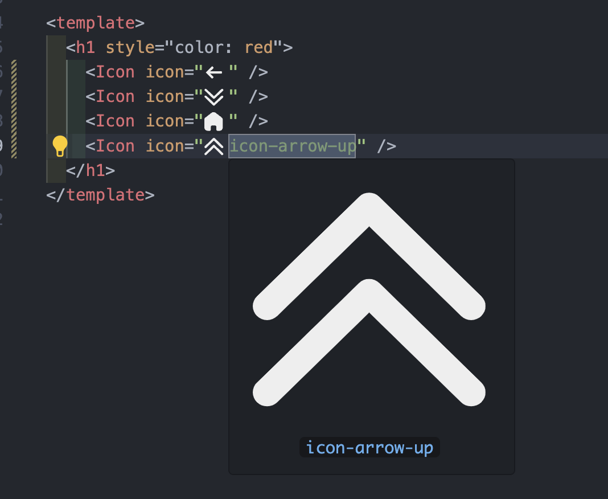

# vite-plugin-iconify-generator

A Vite plugin that generates Iconify JSON from local SVG files. Supports VSCode real-time preview.

把本地的 SVG 文件生成 Iconify JSON 的 Vite 插件。支持 VSCode 实时预览

## Features 特性

- Automatically generates Iconify JSON from a directory of SVG files.
- Supports deep directory structure for organizing SVG files.
- Cleans and optimizes SVG files.
- Automatically regenerates Iconify JSON on file changes during development.

- 自动从 SVG 文件目录生成 Iconify JSON。
- 支持深层目录结构来组织 SVG 文件。
- 清理和优化 SVG 文件。
- 在开发过程中，文件变化时自动重新生成 Iconify JSON。

## Installation 安装

### English

Install the plugin using npm:

```bash
npm install vite-plugin-iconify-generator
```

vite.js usage
```javascript
import { defineConfig } from 'vite';
import vue from '@vitejs/plugin-vue';
import iconifyPlugin from 'vite-plugin-iconify-generator';

export default defineConfig({
  plugins: [
    vue(),
    iconifyPlugin({
      sourceSVGDir: 'src/assets/icons/svg', // Path to your SVG files
      target: 'iconify.json',              // Output path for the generated JSON file
      prefix: 'custom',                    // Prefix for the icons
    }),
  ],
});
```

## Other
- `sourceSVGDir`支持子目录
- vscode 安装 `antfu.iconify` 插件后，在项目根目录新建 `.vscode` 文件夹，其中 `settings.json`设置为
```JSON
  "iconify.customCollectionJsonPaths": [
    "./iconify.json"
  ]
```
这样 vscode 中即可预览 SVG icon
